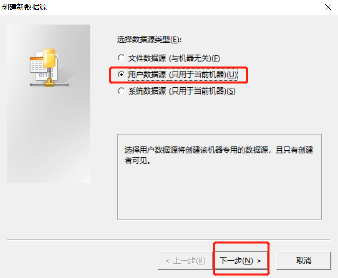
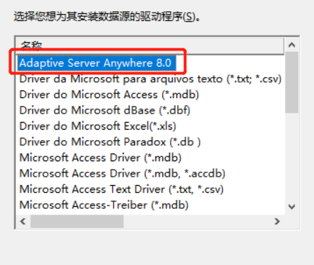
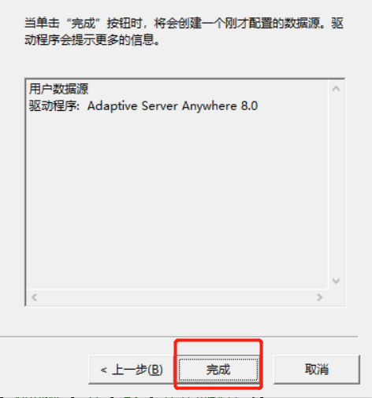
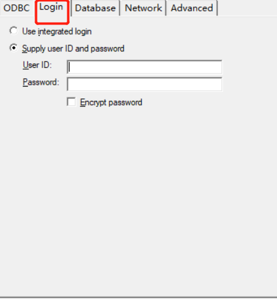
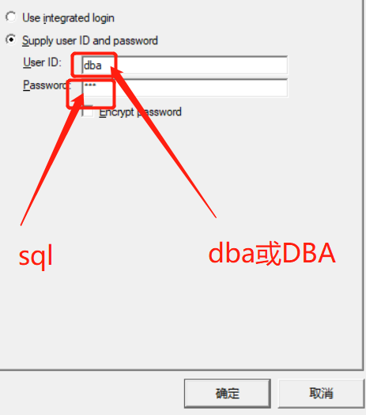
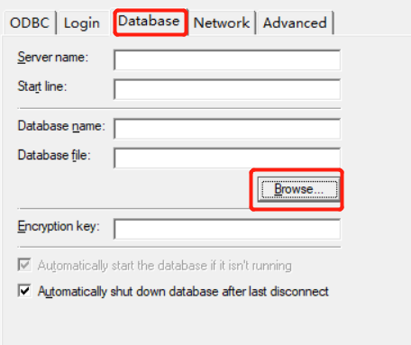
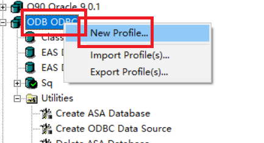
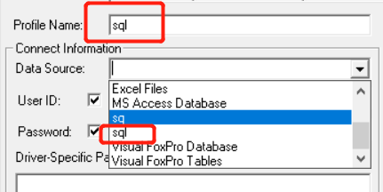
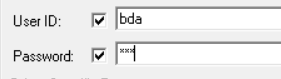
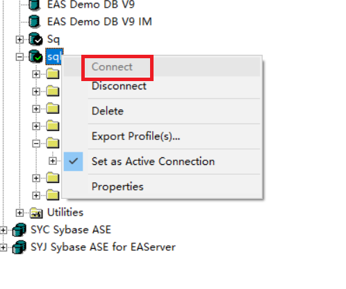

# PB导入数据库

## 数据库导入
如何导入第三方数据库？
选择`Utilities`如何选择`Create ODBC Data Source`

选择第二个即可如然后点击下一步。

下一步

​	完成

名字自定义！

选中`Login`

输入账号：`dba`密码`sql`

选择`Database`选中`Browser……`

找到后缀为`.db`的文件

点击确认以后
到数据库中`ODB ODBC`右键选择`new Profule…`

其中`Profile Name`可以自定义
`Data Source`就是你之前定义的`ODBC`名字

这里是账号密码

确认以后找到刚刚自定义的数据名字
右键点击`Connect`

