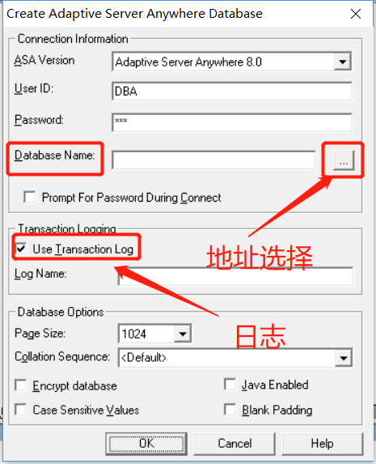

# 	PB数据库搭建

### 版本说明

这里使用的是：`PowerBuilder 9.0`

## 新建数据库

1、进入PB点击数据库按钮


2、选择`ODB ODBC`数据量


3、选择`Utilities`然后选择里面的`Create ASA Database`


4、对数据库进行保存

`Database Name`：保存的目标地址，点击地址选择按钮进行

`Use Transaction Log`：日志文件生成（是否需要更据自己实践情况决定）



确认即可


此时就出现了我们的数据库


### 创建数据表

* 方法一：表格法：


更据内容填写相对应的值即可

* 方法二：使用SQL代码完成编译


代码如下：

```sql
create table S( sno char(4),sname char(8),sex char(2),age char(2),sdept char(10),primary key(sno));
```

输入代码以后一点击`Design`然后选择`Execute ISQL……`进行运行或者使用快捷键`Ctrl+L`

温馨提示：点击一遍就行（不要问为什么！）


### 查看内容

`Tables`右键选择`Refresh`刷新即可

（如果没有响应，可以重启软件）


## 表的查看

* 使用窗口进行查看

  选中表以后右键`Edit Data`然后`Grid…`

  

* 使用代码进行查看

  ```sql
  select * from S;
  ```

  


### 添加数据表数据

```sql
insert into S values('9801','李铭','男','19','计算机软件');
insert into S values('9802','刘晓鸣','男','20','计算机应用');
insert into S values('9806','刘成刚','男','21','计算机软件');
insert into S values('9807','王铭','男','22','计算机应用');
insert into S values('9808','宣明尼','女','18','计算机应用');
insert into S values('9809','柳红利','女','19','计算机软件');
insert into S values('9803','李明','男','22','计算机应用');
insert into S values('9804','张鹰','女','21','计算机软件');
insert into S values('9805','刘竟静','女','22','计算机软件');
select * from S;
```


结果查看：


