# 基于PB实现窗口计算器

## 新建一个环境
`File`->`New`

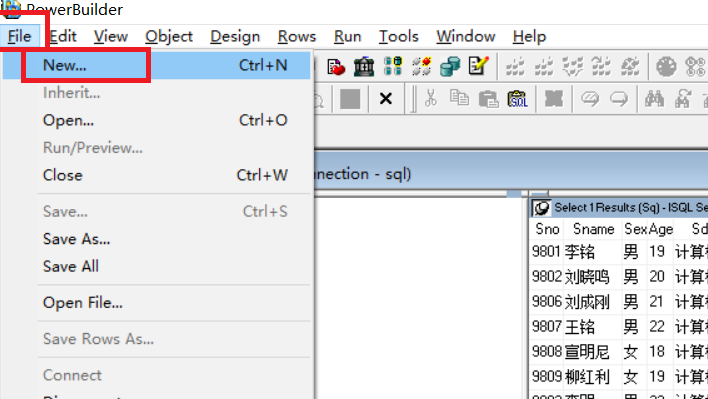

`Woekspace`->`Workspace`->`ok`

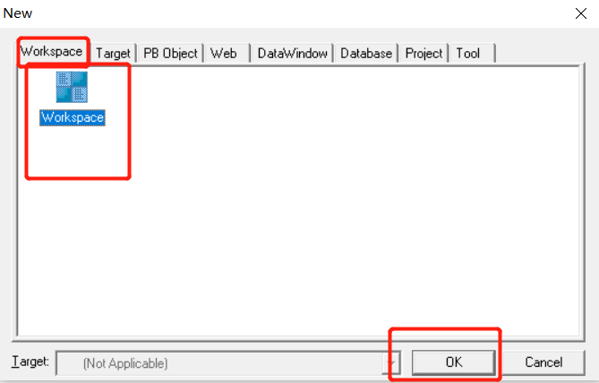	

输入文件名确认

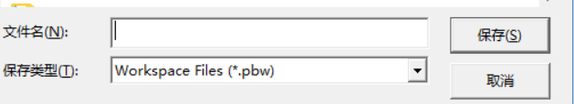

查看即可得到我们的环境

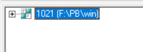

## 添加`Target`
`Target`->`Application`->`OK`

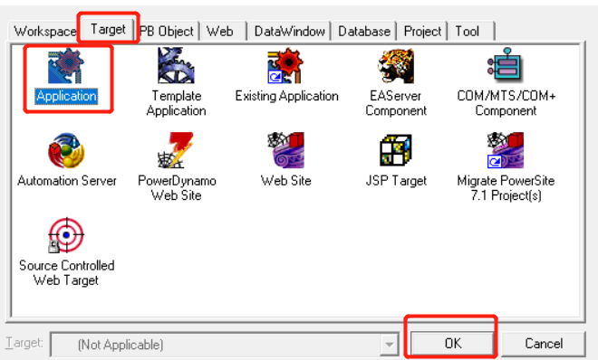

添加名字即可，后面的是自动生成的。

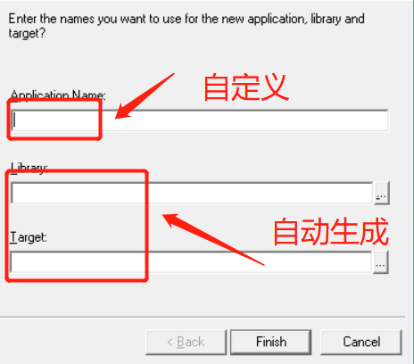

查看内容

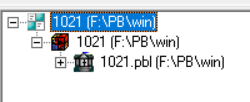

### 生成窗口
`PB Object` ->`Window`->`OK`

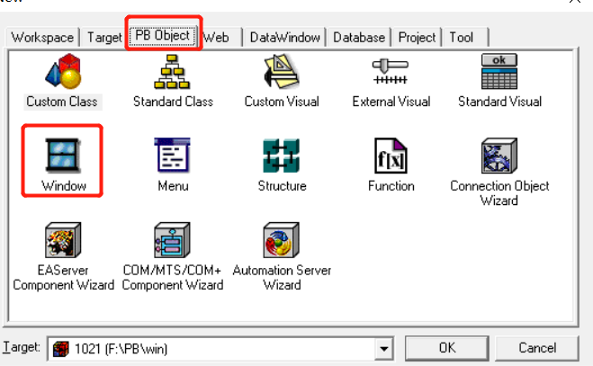

查看窗口

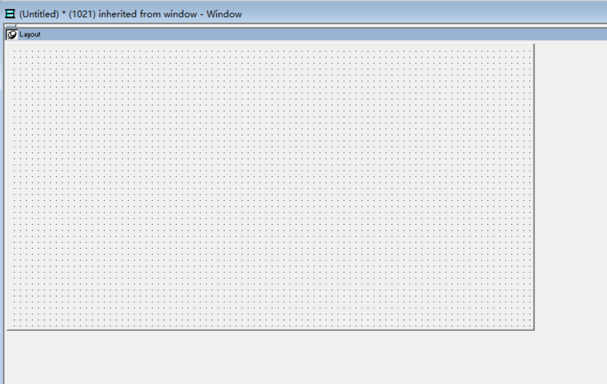

## 插入组件
`Insert`->`Control`->`CommandButton`

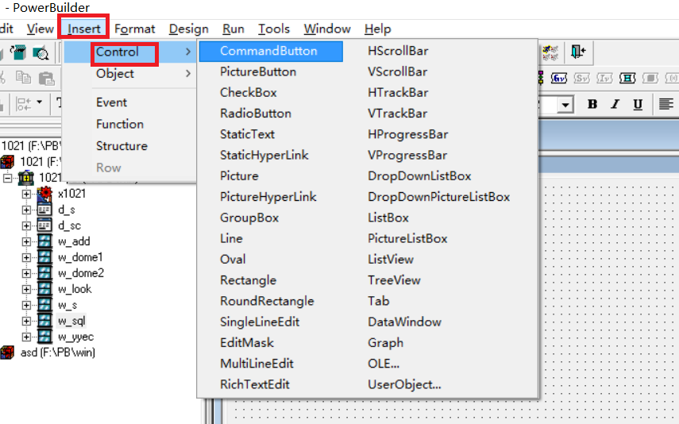


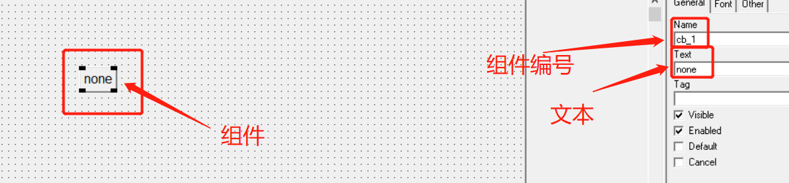


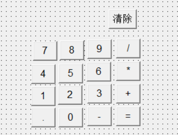

* 添加`SingleLineEdit`组件

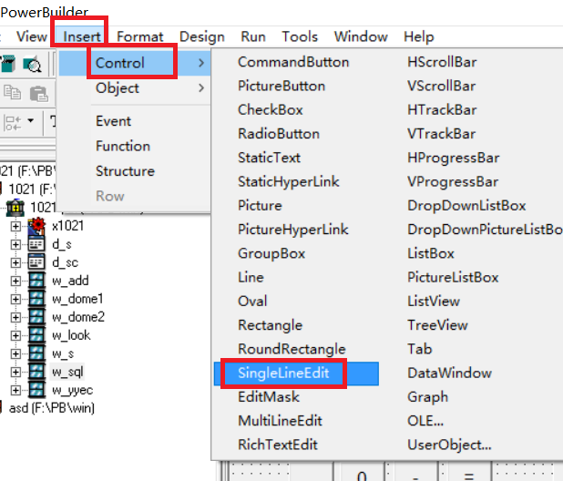


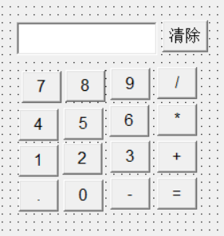	

* 添加`Static Text`组件

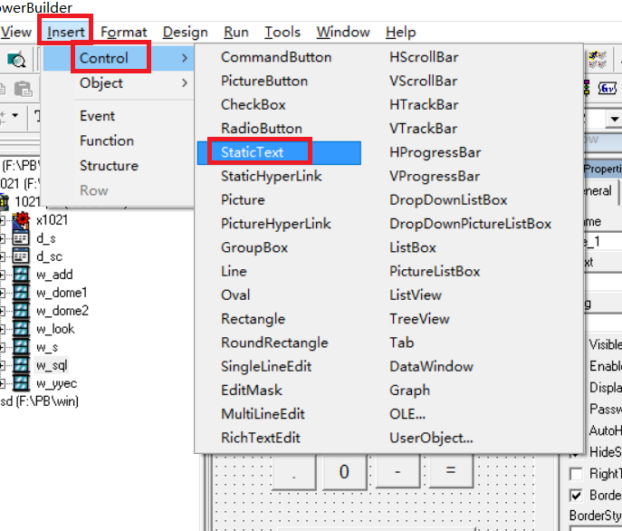

## 组件成果展示

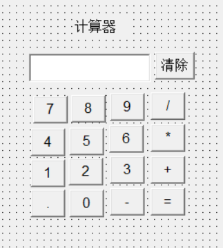

### 添加代码
添加全局变量

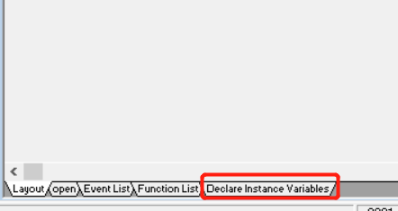

### 声明变量
```sql
decimal data  //保存中间结果
char str    //保存按下的运算符
int flag    //flag=1表示按下的数字是前面数字的一部分，flag=0表示按下的数字是一个新的数字的开始
```
### 十个数字按钮和小数点按钮代码

```sql
if flag=0 then 
	sle_1.text=""
	flag=1
end if
sle_1.text=sle_1.text+this.text
```
### +、-、*、/运算按钮代码

```sql
choose case str
	case '*'
		sle_1.text=string(dec(sle_1.text)*data)
	case '/'
		sle_1.text=string(data/dec(sle_1.text))
	case '+'
		sle_1.text=string(dec(sle_1.text)+data)
	case '-'
		sle_1.text=string(data - dec(sle_1.text))
end choose
data=dec(sle_1.text)
str=this.text
flag=0
```
### “=”按钮代码

```sql
choose case str
	case '*'
		sle_1.text=string(dec(sle_1.text)*data)
	case '/'
		sle_1.text=string(data/dec(sle_1.text))
	case '+'
		sle_1.text=string(dec(sle_1.text)+data)
	case '-'
		sle_1.text=string(data - dec(sle_1.text))
end choose
flag=0
str=''
```
`ctrl+S`保存项目使用`W_`开头

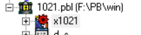

```sql
open(w_calculator)
```